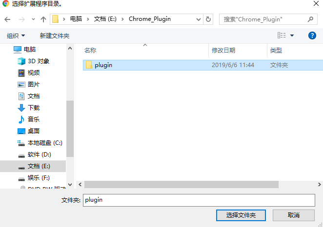

# 简书不显示图片的解决方法

首次编辑于2019-6-6

最近几天在浏览简书上的文章时，发现图片显示不出来，提示"系统维护中，图片暂时无法加载"。


猜测应该是简书由于某种原因暂时屏蔽了图片的显示，但是图片不显示，对于阅读上的体验确实很差。

可以通过以下方法显示图片(基于Chrome浏览器)(参考以下网址:<https://www.cnblogs.com/gobyte/p/10977351.html>)：

在显示有问题的页面，按快捷键Ctrl+Shift+J，打开Console窗口，粘贴以下代码到窗口中，然后回车后，即可正常显示图片

```js
$.each($(".image-loading"),function(i,obj){
    var $o = $(obj);
    var link = $o.attr("data-original-src")
    $o.attr("src",link);
    $o.addClass("illustration");
    $o.removeClass("image-loading");
    var $fu = $(obj.parentNode);

})
$(".image-view-maintain").removeClass("image-view-maintain");
```


但这个解决方案有一个问题，如果页面刷新后，图片还是会显示不出来，需要再次往console中写入js后执行才可以正常显示。

基于原来的方案，将脚本打包成Chrome浏览器插件，就可以解决每次都需要刷新的问题。

1、将扩展程序下载到本地电脑,下载地址:<https://raw.githubusercontent.com/milovetingting/Plugin/master/plugin.rar>

下载回来后，选择解压到当前文件夹，会有一个plugin的文件夹。

2、打开:更多工具-扩展程序，如下图:


打开右上角的开发者模式,点击"加载已解压的扩展程序",在弹出的窗口中选择解压出来的plugin文件夹



首先选中plugin文件夹，然后点击"选择文件夹"

扩展程序就已经加载成功，如图：


在之前的图片显示异常的页面，重新刷新页面就可以正常显示图片。对于新打开的简书页面，图片就会正常显示。

> 简书图片显示不出来应该也只是暂时的，此解决方案仅供不能正常显示的一段时期使用。
